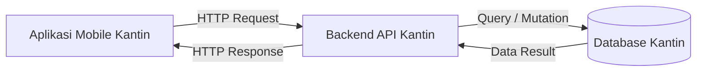

Nama: Muhammad Aulia Ramadhani
NIM: 230660221013
Kelas: SI-VIIA
Domain: Kantin Kampus

1. Deskripsi Sistem

Sistem ini ditujukan bagi mahasiswa sebagai pembeli utama dan pemilik stan kantin sebagai pengelola pesanan. Masalah utama yang dihadapi saat ini adalah antrean panjang pada jam istirahat serta keterbatasan waktu mahasiswa untuk menunggu proses memasak secara langsung di lokasi. Solusi ini diimplementasikan dalam bentuk aplikasi mobile karena relevan dengan karakteristik sesi penggunaan singkat (mahasiswa dapat memesan cepat dalam beberapa detik di sela kuliah) dan konteks bergerak (pemesanan dapat dilakukan saat pengguna dalam perjalanan menuju kantin).

2. Diagram Arsitektur

File diagram arsitektur dapat dibuat menggunakan sintaks Mermaid berikut (`diagram.mmd`):

3. Tabel Kebutuhan

| No. | Permintaan | Pengguna | Karakteristik Mobile yang Terkait | Fitur Aplikasi | Materi Pemenuh |
| --- | --- | --- | --- | --- | --- |
| 1 | Melihat menu makanan yang tersedia hari ini | Mahasiswa | Layar kecil: Membutuhkan tampilan daftar/grid yang responsif dan ringkas. | Halaman Katalog Menu (ListView & Card) | Minggu 2 (UI Basic) |
| 2 | Menyimpan menu favorit agar bisa diakses cepat tanpa internet | Mahasiswa | Konektivitas terbatas: Mengakomodasi jaringan kampus yang kadang tidak stabil. | Penyimpanan Favorit Lokal (SQLite / SharedPreferences) | Minggu 5 (Data Lokal) |
| 3 | Memesan makanan dan mengirimkan data pesanan | Mahasiswa | Sesi penggunaan singkat: Transaksi diselesaikan cepat melalui beberapa ketukan jari. | Form Pemesanan & Integrasi REST API | Minggu 6 (REST API) |
| 4 | Mendapatkan notifikasi saat pesanan siap diambil | Mahasiswa | Konteks bergerak: Mahasiswa tidak perlu menunggu di depan stan kantin. | Local / Push Notification | Minggu 8 (Fitur Perangkat) |
| 5 | Menginput, mengubah, dan menghapus stok menu kantin | Petugas Stan | *Di luar lingkup (backend SI)* | Web Admin Panel (Backend SI) | Di luar lingkup mobile |
| 6 | Memvalidasi pembayaran secara otomatis dari gateway pembayaran | Petugas Stan | *Di luar lingkup (backend SI)* | Webhook Payment Gateway (Backend SI) | Di luar lingkup mobile |

4. Bukti Environment Siap

*(Pastikan file tangkapan layar sudah disimpan pada struktur folder berikut)*

* `flutter-doctor/sebelum.png`
* `flutter-doctor/sesudah.png`
* `aplikasi.png`

5. Refleksi

Fitur perangkat yang paling relevan untuk domain pemesanan kantin kampus ini adalah notifikasi. Fitur ini memungkinkan aplikasi memberi tahu mahasiswa secara langsung ketika makanan mereka selesai dimasak oleh petugas stan. Tanpa notifikasi, mahasiswa harus terus membuka aplikasi atau menunggu di lokasi, yang menghilangkan efisiensi dari pemesanan jarak jauh.

